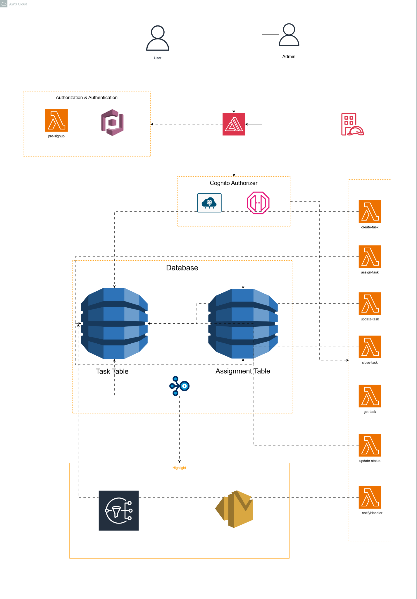

# Serverless Task Management System

A serverless task management application built on AWS that enables teams to create, assign, and track tasks with role-based access control, real-time email notifications, and enterprise-grade security.

## Overview

This project demonstrates a complete serverless architecture on AWS, featuring:
- **Multi-tenant task management** with admin and member roles
- **Real-time notifications** via SNS and email delivery
- **Secure authentication** using AWS Cognito with domain-based access control
- **Scalable backend** using AWS Lambda and DynamoDB
- **Modern frontend** built with React.js and hosted on AWS Amplify
- **Infrastructure as Code** using Terraform for reproducible deployments

The system is designed to be domain-restricted (@amalitech.com, @amalitechtraining.org) with mandatory email verification, ensuring secure access for team members only.

## Architecture

### Architecture Diagram



### Core Components

- **Frontend**: React.js application with task dashboard, creation, assignment, and detail views
- **Authentication**: AWS Cognito User Pool with email verification and role-based groups
- **API Gateway**: RESTful API with JWT-based authorization and CORS
- **Serverless Functions**: 9 Lambda functions (Python 3.11) handling business logic
- **Data Storage**: DynamoDB tables for tasks, assignments, and users with Global Secondary Indexes
- **Notifications**: SNS topics integrated with Lambda for email-based alerts
- **Infrastructure**: Terraform modules for complete AWS resource provisioning

### Security Features

- Email domain restrictions enforced at Cognito level
- Role-based access control (Admin/Member groups)
- JWT token validation on API Gateway
- Encrypted data at rest (DynamoDB, SNS)
- Least privilege IAM roles for each Lambda function
- X-Ray tracing for distributed request tracking
- Email verification required before account activation

## Prerequisites

- AWS Account
- Terraform >= 1.5.0
- AWS CLI configured with appropriate credentials
- Node.js >= 18.x (for frontend development)
- Python >= 3.11 (for Lambda development)
- Git

## Project Structure

```
task_manager_serverless/
├── terraform/                 # Infrastructure as Code
│   ├── modules/              # Reusable Terraform modules
│   │   ├── amplify/          # React frontend hosting
│   │   ├── api-gateway/      # REST API and authorizers
│   │   ├── cognito/          # User authentication and authorization
│   │   ├── dynamodb/         # NoSQL database tables
│   │   ├── iam/              # IAM roles and policies
│   │   ├── lambda/           # Serverless functions
│   │   ├── ses/              # Email delivery service
│   │   └── sns/              # Notification topics
│   ├── main.tf               # Main infrastructure definition
│   ├── variables.tf          # Input variables
│   ├── outputs.tf            # Output values
│   ├── backend.tf            # Terraform state backend
│   ├── providers.tf          # AWS provider configuration
│   └── terraform.tfvars      # Variable values
├── lambda/                   # Serverless function implementations
│   ├── create-task/          # Create new tasks
│   ├── update-task/          # Update task details
│   ├── get-tasks/            # Retrieve task list
│   ├── get-users/            # List available users
│   ├── assign-task/          # Assign tasks to users
│   ├── close-task/           # Mark tasks as closed
│   ├── update-status/        # Update task status
│   ├── email-dispatcher/     # Send email notifications
│   └── notify-handler/       # Handle notification logic
├── frontend/                 # React.js frontend application
│   ├── src/
│   │   ├── components/       # React components
│   │   │   ├── Dashboard.js
│   │   │   ├── TaskList.js
│   │   │   ├── CreateTask.js
│   │   │   ├── TaskDetail.js
│   │   │   └── AssignTask.js
│   │   ├── services/         # API service client
│   │   ├── App.js
│   │   └── index.js
│   ├── public/
│   ├── build/                # Production build output
│   └── package.json
├── scripts/                  # Utility scripts
│   ├── deploy.sh
│   ├── destroy.sh
│   ├── generate-env.sh
│   └── setup-users.sh
├── Serverless.drawio.svg     # Architecture diagram
└── README.md                 # This file
```

## Deployment

### Infrastructure Setup

1. **Configure Terraform Variables**

Edit `terraform/terraform.tfvars` with your AWS details:

```hcl
aws_region             = "us-east-1"
project_name           = "task-management"
environment            = "production"
allowed_email_domains  = ["amalitech.com", "amalitechtraining.org"]
admin_email            = "admin@amalitech.com"
```

2. **Initialize and Deploy Terraform**

```bash
cd terraform
terraform init
terraform plan
terraform apply
```

3. **Retrieve API Endpoint**

```bash
terraform output api_endpoint
terraform output user_pool_id
terraform output user_pool_client_id
```

### Frontend Configuration

1. **Create environment file** in `frontend/.env`:

```bash
REACT_APP_AWS_REGION=us-east-1
REACT_APP_USER_POOL_ID=<from-terraform-output>
REACT_APP_USER_POOL_CLIENT_ID=<from-terraform-output>
REACT_APP_API_ENDPOINT=<from-terraform-output>
```

2. **Install and run locally**:

```bash
cd frontend
npm install
npm start
```

3. **Build for production**:

```bash
npm run build
```

The build artifacts are automatically deployed via AWS Amplify when integrated with your Git repository.

## Lambda Functions

| Function | Purpose | Trigger |
|----------|---------|---------|
| `create-task` | Create a new task | API Gateway POST /tasks |
| `update-task` | Update task details | API Gateway PUT /tasks/{id} |
| `get-tasks` | Retrieve task list | API Gateway GET /tasks |
| `get-users` | List available users | API Gateway GET /users |
| `assign-task` | Assign task to user | API Gateway POST /tasks/{id}/assign |
| `close-task` | Close/complete task | API Gateway POST /tasks/{id}/close |
| `update-status` | Update task status | API Gateway PUT /tasks/{id}/status |
| `email-dispatcher` | Send email notifications | SNS topic |
| `notify-handler` | Process notification events | SNS topic |

Each function includes its own `requirements.txt` for Python dependencies.

## API Endpoints

```
POST   /tasks              - Create task
GET    /tasks              - List tasks
PUT    /tasks/{id}         - Update task
POST   /tasks/{id}/assign  - Assign task to user
POST   /tasks/{id}/close   - Close/complete task
PUT    /tasks/{id}/status  - Update task status
GET    /users              - List available users
```

All endpoints require JWT authentication via Cognito.

## Database Schema

### Tasks Table
- `taskId` (PK): Unique task identifier
- `title`, `description`: Task details
- `priority`, `status`: Task state
- `createdBy`, `createdAt`: Audit info
- `GSI: CreatedByIndex`, `GSI: StatusIndex`: Query optimization

### Assignments Table
- `assignmentId` (PK): Unique assignment identifier
- `taskId`, `userId`: Relations
- `assignedBy`, `assignedAt`: Audit info
- `GSI: TaskIdIndex`, `GSI: UserIdIndex`: Query optimization

### Users Table
- `userId` (PK): Unique user identifier
- `email`, `role`: User details
- `status`, `createdAt`: Account state
- `GSI: EmailIndex`: Email-based lookups

## Development

### Local Testing

```bash
# Frontend
cd frontend && npm install && npm start

# Lambda functions (with local testing framework)
pip install -r lambda/<function>/requirements.txt
```

### Terraform Validation

```bash
cd terraform
terraform fmt -recursive    # Format HCL
terraform validate         # Validate syntax
```

## Monitoring and Logging

- **CloudWatch Logs**: Lambda execution logs and API Gateway access logs
- **X-Ray Tracing**: Distributed request tracing across Lambda functions
- **CloudWatch Metrics**: API latency, error rates, and usage statistics

## Notes

- The project uses AWS free tier resources where possible
- Terraform state is stored locally (consider S3 backend for production)
- Email notifications require SES sandbox verification or domain verification
- Domain-based access control is enforced at the Cognito User Pool level 

